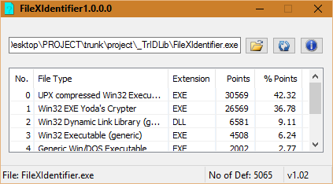

 
 
 
 

# FileXIdentifier
FileXIdentifier is a tool to identify real file extension for windows os based on TrIDLib.
See the [change log](CHANGELOG.md) for changes and road map.

## Binaries
Download the source code or binary only in [FileXIdentifier Releases](https://github.com/gajjartejas/FileXIdentifier/releases/latest)

## Features 
- FileXIdentifier is a tool to identify real file extension for windows os based on TrIDLib.
- Drag and drop support.

## Screenshot

## Contribute
For cloning and building this project yourself, make sure
to install the
[AutoIt](https://www.autoitscript.com/site/autoit/) 
and
[AutoIt Script Editor](https://www.autoitscript.com/site/autoit-script-editor/downloads/)
For windows.

To compile this project Right click on  [FileXIdentifier.au3](FileXIdentifier.au3) and select Compile with Options.
This action opens a new dialog box. Hit compile button to compile, a compiled binary will generate on same folder.

## License
*GNU GENERAL PUBLIC LICENSE version 3* by [Free Software Foundation, Inc.](http://fsf.org/) converted to Markdown.
Read the [original GPL v3](http://www.gnu.org/licenses/).
